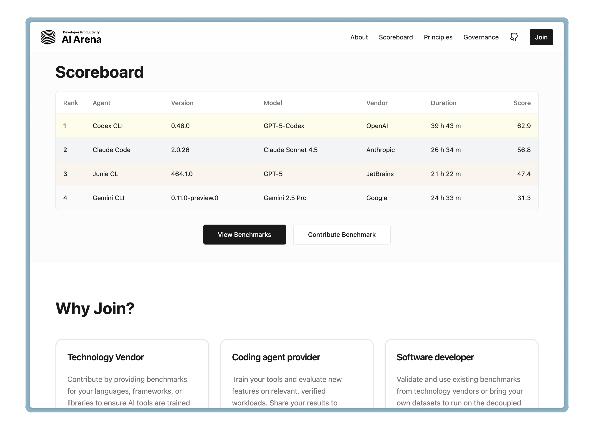

# Battle of the Bots: {.r-fit-text data-background="images/1.png"}
## Which AI Assistant Delivers?
#### Calvin Hendryx-Parker, CTO
#### Six Feet Up

---

# AI Coding Assistants {.r-fit-text data-background="images/2.png"}
## The New Pair-Programming Partners {.r-fit-text}

### Rapid Evolution over the last year:

> More than 97% of respondents reported having used AI coding tools at work
>
> -- [2024 Github AI in Software Survey](https://github.blog/news-insights/research/survey-ai-wave-grows/)

---

# Why This Matters {.r-fit-text data-background="images/9.png"}

- AI coding assistants are transforming how we build software
- Choosing the right tool can mean the difference between frustration and flow
- Let’s find out which one delivers for real-world developers!

---

# The Contenders {data-background="images/3.png"}

- Aider
- Claude Code
- Cursor
- Goose
- Junie
- OpenAI Codex

::: notes
- Aider: Git-integrated assistant that understands entire codebases and can commit changes
- Claude Code: Anthropic's CLI tool with advanced context awareness and precise refactoring capabilities
- Cursor: Editor-integrated solution enabling real-time collaborative coding and debugging
- Goose: Specialized in API development with strong documentation capabilities
- Junie: JetBrain's new agentic assistant embedded into their IDE tools
- OpenAI Codex: OpenAI’s agentic coding suite with an open-source CLI and IDE extensions
 
 From basic code completion to full-fledged pair programmers in just one year
:::

---

# What is an AI Agent? {.r-fit-text data-background="images/4.png"}

- Perceives environment via tools/APIs
- Plans and decides autonomously
- Takes actions toward goals (edit code, run tests, call tools)
- Maintains context/memory within a session
- Learns from feedback and iterates
- Chains multi‑step operations

::: notes
- Definition: senses (tools), memory (context), planning (plan/steps), acting (tool calls)
- Examples: code edit + run tests + git commit; fetch docs via MCP; browse with Playwright MCP
- Safety: approval modes, sandboxed shells, read‑only vs full access; always review staged diffs
- Limits: non‑determinism, tool auth/permissions, context windows—use rules/conventions files
:::

---

# What is MCP? {data-background="images/6.png"}

{.r-stretch .r-frame .r-center}

::: notes
The Model Context Protocol is an open standard that enables developers to build
secure, two-way connections between their data sources and AI-powered tools. The
architecture is straightforward: developers can either expose their data through
MCP servers or build AI applications (MCP clients) that connect to these
servers.
:::

---

# MCP Examples {data-background="images/8.png"}

- A [suite of specialized MCP servers](https://github.com/awslabs/mcp) for AWS:
  - Saves the cost of having all the AWS docs in your own context
- Use [Playwright from your AI Tools](https://github.com/microsoft/playwright-mcp)
  - Control a browser and grab the context from various web pages
- [Serena MCP](https://github.com/oraios/serena) Language Server
  - Semantic code retrieval and editing tools
 
---

# In practice {data-background="images/8.png"}

- Connect your AI assistant to AWS MCP servers
- Ask natural language questions about AWS services
- Get contextually accurate answers based on latest documentation
- Generate AWS CLI commands, CloudFormation templates, or IAM policies
- Troubleshoot AWS-specific issues with current best practices

---

# Tool introduction: Aider {.r-fit-text data-background="images/9.png"}

- Developed by Paul Gauthier
- Open-source ([GitHub: paul-gauthier/aider](https://github.com/paul-gauthier/aider))
- Supports multiple LLM models (OpenAI, Claude, Llama, BYOM)
- Semi-agentic with git integration
- No MCP support currently
- Supports `/voice` interactions
- Use Multiple Models in the same session

---

# What's New in Aider {.r-fit-text data-background="images/9.png"}

- **Models**: GPT‑5, Claude 4, Gemini 2.5, Grok‑4, DeepSeek; o1/o3/o4‑mini
- **Reasoning**: `/think‑tokens`; `/reasoning‑effort`
- **UX/CLI**: `/context`; `/editor` (`/edit`); shell comps; notifications
- **Git**: Conventional Commits; Co‑authored‑by; `--commit‑language`; clearer `/undo`
- **Repo**: 130+ langs; better identifier ranking; repo‑map expands coverage
- **Watcher/Web**: sturdier file watcher; optional Playwright scrape

::: notes
- Reasoning toggles (/think‑tokens, /reasoning‑effort)
- OpenRouter: OAuth sign‑in; cached pricing/metadata
- UX: `/context`, `/editor` (`/edit`); commands/conventions docs — https://aider.chat/docs/usage/commands/ | https://aider.chat/docs/usage/conventions/
- Caveat: Architect mode, file watcher, browser UI existed pre‑Apr 2025
:::
---

# Tool introduction: Claude Code {.r-fit-text data-background="images/10.png"}

- Developed by [Anthropic](https://www.anthropic.com/claude)
- Proprietary model and tooling
- Uses Claude models: Sonnet 4.5, Opus 4.1, Haiku 4.5
- Fully agentic with planning, tools, and subagents
- Supports MCP (Model Context Protocol) since its inception
- Ships as a terminal app and a native VS Code extension

---

# What's New in Claude Code {.r-fit-text data-background="images/10.png"}

- **Models**: Sonnet 4.5 (default); Opus 4.1; Haiku 4.5
- **CLI/VS Code**: Native extension; smoother terminal; transcript shows model; `/export`
- **Commands**: `/rewind`; `/usage`; thinking toggle; Ctrl‑R history
- **Plugins/Skills**: Install/enable/marketplace; `/doctor`; Claude Skills
- **Bash/Sandbox**: Background commands; tab completion; BashTool sandbox (macOS/Linux)
- **Hooks/MCP**: Hooks events; @‑mentions; multi‑config; OAuth discovery

::: notes
- MCP support isn’t new (added in 2024); the recent changes are usability and enterprise enhancements
- Hooks docs: https://docs.claude.com/en/docs/claude-code/hooks
- Sources: Claude Code CHANGELOG and docs release notes
  - https://github.com/anthropics/claude-code/blob/main/CHANGELOG.md
  - https://docs.claude.com/en/release-notes/claude-code
:::

---

# Tool introduction: Cursor {.r-fit-text data-background="images/1.png"}

- Developed by Anysphere Inc. (independent company)
- Proprietary editor with open-source components
- Supports OpenAI, Anthropic, and Google models
- Fully agentic with project navigation
- Supports [MCP](https://cursor.com/docs/context/mcp)

---

# What's New in Cursor {.r-fit-text data-background="images/1.png"}

- **Background Agents**: Continuous VMs; GitHub/IAM; dashboards
- **Modes**: Agent; Ask; Plan; Custom (reviewable plans)
- **Rules**: `.cursor/rules`; `AGENTS.md`; `/Generate Cursor Rules`
- **Headless/CI**: Headless CLI; GitHub Actions
- **MCP**: Client + Extension API; directory/install
- **Browser/Enterprise**: Built‑in browser; Admin API; Analytics; SSO/SCIM; spend controls

::: notes
- Background Agents: docs, API, webhooks — https://cursor.com/docs/background-agent | https://cursor.com/docs/background-agent/api/overview | https://cursor.com/docs/background-agent/api/webhooks
- Modes & Rules: https://cursor.com/docs/agent/modes | https://cursor.com/docs/context/rules
- Headless/CI & MCP: https://cursor.com/docs/cli/headless | https://cursor.com/docs/cli/github-actions | https://cursor.com/docs/context/mcp | https://cursor.com/docs/context/mcp-extension-api | https://cursor.com/docs/context/mcp/directory | https://cursor.com/docs/context/mcp/install-links
- Browser: https://cursor.com/docs/agent/browser
- Enterprise, Models & Changelog: https://cursor.com/docs/enterprise | https://cursor.com/docs/account/teams/admin-api | https://cursor.com/docs/account/teams/analytics-v2 | https://cursor.com/docs/enterprise/usage-and-spend-controls | https://cursor.com/docs/enterprise/model-and-integration-management | https://cursor.com/docs/account/teams/sso | https://cursor.com/docs/account/teams/scim | https://cursor.com/docs/context/max-mode | https://cursor.com/docs/models | https://www.cursor.com/changelog
:::

---

# Tool introduction: Goose {.r-fit-text data-background="images/2.png"}

- Developed by Block Inc. (formerly Square)
- Open-source ([GitHub: block/goose](https://github.com/block/goose))
- Supports multiple LLM models (OpenAI, Claude, Ollama)
- Fully agentic with integrated tooling
- Supports [MCP](https://block.github.io/goose/docs/getting-started/using-extensions#mcp-servers)
- Supports OpenRouter! (<https://openrouter.ai>)

---

# What's New in Goose {.r-fit-text data-background="images/2.png"}

- **Recipes**: Repeatable workflows; cookbook generator
- **Subagents/Subrecipes**: Parallel delegation (experimental)
- **MCP‑UI**: Intent‑based UIs; auto visualizer (early)
- **Containers**: Isolated envs via Dagger/container MCP
- **Multi‑model**: Lead/Worker orchestration; per‑task routing
- **Providers/ACP**: OpenRouter; Tetrate Agent Router; ACP editor integration

::: notes
- Multi‑model (Lead/Worker): https://block.github.io/goose/docs/tutorials/lead-worker | https://block.github.io/goose/blog/2025/06/16/multi-model-in-goose
- Recipes + Containers: https://block.github.io/goose/blog/2025/05/06/recipe-for-success | https://block.github.io/goose/blog/2025/06/19/isolated-development-environments
- Subagents/Subrecipes (experimental) + MCP‑UI: https://block.github.io/goose/blog/2025/09/26/subagents-vs-subrecipes | https://block.github.io/goose/blog/2025/09/15/subrecipes-in-goose | https://block.github.io/goose/blog/2025/08/27/autovisualiser-with-mcp-ui
- Providers (OpenRouter/Tetrate) + ACP: https://block.github.io/goose/blog/2025/07/29/openrouter-unlocks-workshops | https://block.github.io/goose/blog/2025/08/27/get-started-for-free-with-tetrate | https://block.github.io/goose/blog/2025/10/24/intro-to-agent-client-protocol-acp
:::

---

# Tool introduction: Junie {.r-fit-text data-background="images/3.png"}

- Developed by [JetBrains](https://plugins.jetbrains.com/plugin/26104-jetbrains-junie-eap)
- Requires a JetBrains IDE + JetBrains AI plan (AI Pro/Ultimate); EAP plugin on Marketplace
- Models: GPT-5 default; Claude also supported
- Fully agentic with project navigation

::: notes
- As of Aug 7, 2025, GPT-5 is the default model for Junie (configurable); source below in What's New notes
:::

---

# What's New in Junie {.r-fit-text data-background="images/3.png"}

- **Status**: Public EAP (Marketplace)
- **Models**: GPT‑5 default; Claude supported
- **MCP**: In‑IDE support
- **Remote Dev**: macOS, Linux (Windows TBD)
- **GitHub EAP**: Async multi‑tasking (JVM/PHP)
- **Perf/UX**: ~30% faster; transparent plan/log; Ask; Brave; guidelines file

::: notes
- GPT‑5 default + how to try: https://blog.jetbrains.com/blog/2025/08/07/gpt-5-support-in-ai-assistant-junie-kineto/
- Agentic era (MCP, Remote Dev macOS/Linux, 30% faster, GitHub EAP JVM/PHP, grants): https://blog.jetbrains.com/junie/2025/07/the-agentic-ai-era-at-jetbrains-is-here/
- PhpStorm deep dive (guidelines, Ask mode, Brave mode, allowlist): https://blog.jetbrains.com/phpstorm/2025/06/discover-junie-for-phpstorm/
- Junie main page / plugin: https://www.jetbrains.com/junie/ | https://plugins.jetbrains.com/plugin/26104-jetbrains-junie-eap
:::

---

# Tool introduction: OpenAI Codex {.r-fit-text data-background="images/7.png"}

- Developed by [OpenAI](https://openai.com/codex/)
- Two parts: open-source CLI (Rust) + IDE extensions (VS Code, Cursor, Windsurf)
- Runs locally and can read/modify/run code in your repo
- Supports MCP via Agents SDK; can be exposed as an MCP server
- Works on macOS/Linux; Windows via WSL2

---

# What's New: OpenAI Codex {.r-fit-text data-background="images/7.png"}

- **CLI**: TUI agent; open‑source at openai/codex
- **Models**: GPT‑5‑Codex; `/model` or `--model`
- **Approvals**: Auto; Read Only; Full Access
- **Exec**: `codex exec "task..."` (non‑interactive)
- **Images**: `--image path/to/file.png`
- **Cloud/SDK**: Delegate to cloud; Agents SDK; MCP guide

---

# Tool Comparison {data-background="images/4.png"}

| Tool        | Open  | MCP   | Agentic   | Models Supported      |
|-------------|-------|-------|-----------|-----------------------|
| Aider       | Yes   | No    | Semi      | Bring your own        |
| Claude Code | No    | Yes   | Full      | Claude Models         |
| Cursor      | No    | Yes   | Full      | GPT-5, Claude, Gemini |
| Goose       | Yes   | Yes   | Full      | Bring your own        |
| Junie       | No    | Yes   | Full      | Claude 4.5 + GPT-5    |
| Codex       | Yes   | Yes   | Full      | GPT-5-Codex           |

---

# Agentic Coding Models {data-background="images/1.png"}

---

# Developer Productivity AI Arena {.r-fit-text data-background="images/2.png"}

::: notes
- Launched Oct 28th 2025 (yesterday!)
- https://dpaia.dev/
- https://github.com/dpaia
:::
---

# DEMO: The Prompt {data-background="images/4.png"}

> This project was bootstrapped with scaf and has a NextJS frontend in the `frontend` dir and a Django backend in the `backend` dir.
> 
> The scaf template only supports a GraphQL API. Refactor the app to use a REST API.

---

# DEMO: Aider {data-background="images/5.png"}

- Specify conventions in `CONVENTIONS.md`
- Use different models for architect and edit mode simultaneously
- Use external editor with `/editor`
- Run commands and add to output with `/run`
- Show cost with `/tokens`
- Clear context with `/clear`
- Start with `--lint-cmd` and `--test-cmd --auto-test` to run your test suite after each change
 
# DEMO: Claude Code {data-background="images/6.png"}

- Allow tools (e.g.): `claude config add allowedTools "Bash(git:*),Bash(cat:*),Bash(grep:*)"`
- Specify conventions in `CLAUDE.md` (or via Skills/Hooks)
- Doesn't use git to commit changes. TIP: Ask it to "Review the staged changes
  with `git diff --staged` and git commit using conventional commit standard"
- Show usage with `/usage`
- Rewind, compact, and clear context with `/rewind`, `/compact`, and `/clear`

# DEMO: Cursor {data-background="images/8.png"}

- Define project rules in `.cursor/rules` (version-controlled)
- Use `AGENTS.md` at the root or subdirectories for simple instructions
- Generate rules in chat with `/Generate Cursor Rules`
- Switch modes as needed: Agent, Ask, Plan (`Shift+Tab`), Custom

::: notes
- Define project rules in `.cursor/rules` (version-controlled)
- Use `AGENTS.md` at the root or subdirectories for simple instructions
- Generate rules in chat with `/Generate Cursor Rules`
- Switch modes as needed: Agent, Ask, Plan (`Shift+Tab`), Custom

::: notes
- Docs: Rules https://cursor.com/docs/context/rules | Modes https://cursor.com/docs/agent/modes
- Rule precedence: Team Rules → Project Rules → User Rules
- Legacy `.cursorrules` is still supported but will be deprecated
- Plans can be saved to `.cursor/plans`
:::

# DEMO: Junie {data-background="images/10.png"}

- Put project rules in `.junie/guidelines.md`
- Modes: Agent (default) and Ask
- Approvals: Brave Mode or Action Allowlist (regex)
- Exclude with `.aiignore` when needed

::: notes
- Sources: GPT‑5 default https://blog.jetbrains.com/blog/2025/08/07/gpt-5-support-in-ai-assistant-junie-kineto/ | Agentic era https://blog.jetbrains.com/junie/2025/07/the-agentic-ai-era-at-jetbrains-is-here/ | PhpStorm deep dive (guidelines, Ask, Brave, allowlist) https://blog.jetbrains.com/phpstorm/2025/06/discover-junie-for-phpstorm/
- Allowlist example (php artisan) via IDE settings; Brave Mode runs commands without confirmation
- Use `.aiignore` to restrict files; review diffs and rollback if needed
:::

# DEMO: OpenAI Codex {data-background="images/7.png"}

- Start in your repo with the TUI: `codex`
- Choose approval mode: Auto (default) | Read Only | Full Access
- Switch models as needed: `/model` or `--model gpt-5-codex`
- Run one-off tasks non-interactively: `codex exec "task…"`
- Include screenshots/diagrams as input: `--image path/to/file.png`
- Tip: stage and review diffs (`git add -p` + `git diff --staged`) before committing

::: notes
- Repo: https://github.com/openai/codex | Product: https://openai.com/codex/
- Models: optimized for GPT‑5‑Codex; switch with /model or --model
- Non‑interactive exec: `codex exec` for CI or single tasks
- MCP/SDK: Codex works with the OpenAI Agents SDK and MCP integrations
:::

---

# Key Takeaways {.r-fit-text data-background="images/3.png"}

- No single assistant is best for every workflow
- MCP is enabling richer, more context-aware coding
- Open source tools are catching up fast
- Try several and see what fits your style!

---

# Talk To Me  {.r-fit-text data-background="images/1.png"}

📩 <calvin@sixfeetup.com>  
🤝 <https://linkedin.com/in/calvinhp>  
🦋 [@calvinhp.com](https://bsky.app/profile/calvinhp.com)  
